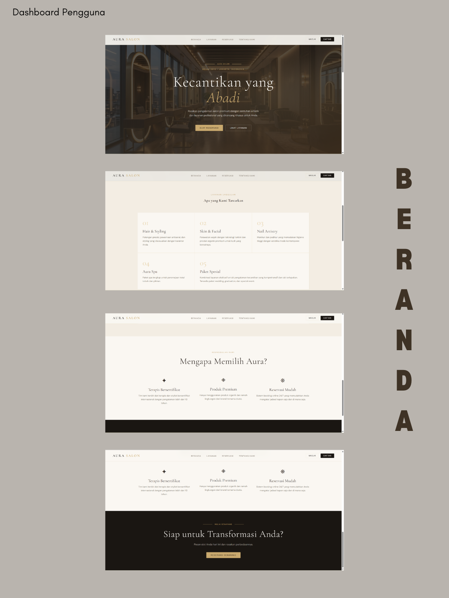
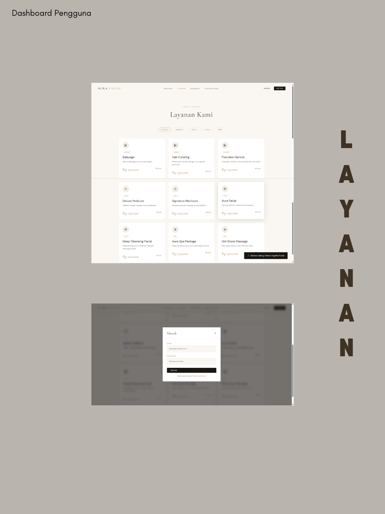
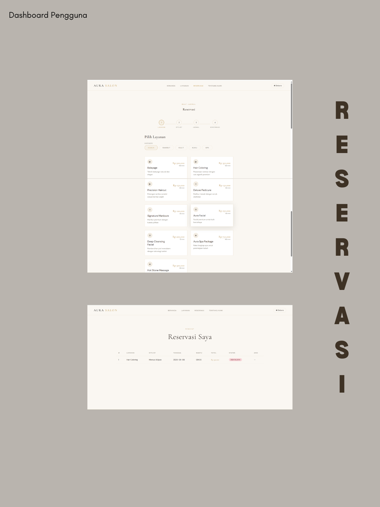
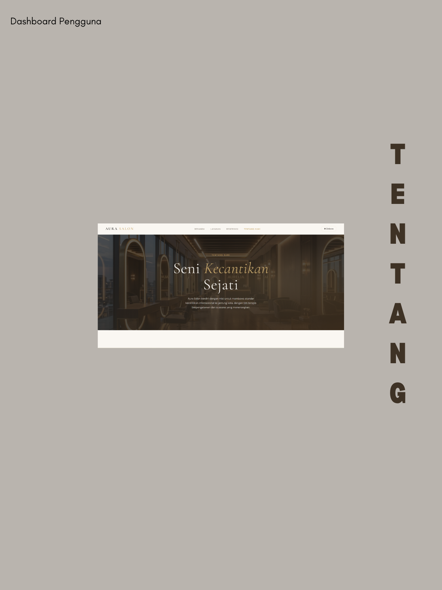
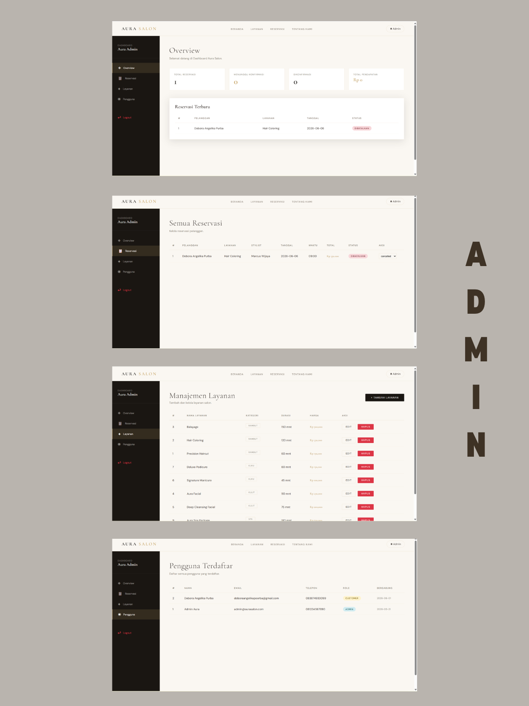

# 🌸 AURA SALON - Sistem Reservasi Layanan Kecantikan

AURA SALON adalah sistem reservasi layanan kecantikan berbasis web yang dirancang untuk memudahkan pelanggan dalam melakukan pemesanan layanan secara online. Web ini dikembangkan menggunakan Python dengan framework Flask sebagai backend, SQLite sebagai database, serta HTML, CSS, dan JavaScript sebagai frontend. Selain itu, sistem ini menerapkan konsep Object-Oriented Programming (OOP) untuk menciptakan kode yang terstruktur, mudah dikelola dan mudah dikembangkan.

## Anggota Kelompok
1. Diana Yakusuma Lestari     (25051204050)
2. Debora Angelika Purba      (25051204051)
3. Firda Ananda               (25051204129)
4. Dimas Giovanni Trisetyanto (25051204168)

## Fitur
- Registrasi & Login pengguna
- Lihat layanan salon (hair, skin, nail, spa)
- Pilih layanan, stylist & slot waktu yang tersedia
- Buat dan batalkan reservasi
- Dashboard admin untuk manajemen reservasi

## Cara Menjalankan

1. Masuk ke direktori backend dan install dependencies:
```bash
   cd backend
   pip install -r requirements.txt
```

2. Jalankan server:
```bash
   python app.py
```

3. Buka web dari file explorer, masuk ke folder frontend dan tekan file index.

## Akun Admin Default
- Email: `admin@aurasalon.com`
- Password: `admin123`

## Implementasi Object-Oriented Programming
1. Encapsulation: Enkapsulasi diterapkan pada kelas Pengguna dan Pemesanan. Atribut penting seperti _id, _username, _emailPengguna, _password, dan _statusPesanan disembunyikan dari akses langsung. Pada kelas Pemesanan, property statusPesanan digunakan untuk mengontrol perubahan status agar hanya menerima nilai yang valid.
2. Inheritance: Kelas Admin dan Pelanggan merupakan turunan dari kelas abstrak Pengguna. Dengan pewarisan, kedua kelas dapat menggunakan atribut dan method dasar yang sama tanpa perlu menuliskan ulang kode.
3. Abstraction: Abstraksi diterapkan melalui penggunaan Abstract Base Class (ABC) pada kelas Pengguna dan BaseRepository. Method abstrak seperti login(), logout(), to_dict(), get_all(), dan get_by_id() mendefinisikan kontrak yang wajib diimplementasikan oleh setiap kelas turunannya.
4. Polymorphism: Method login(), logout(), dan to_dict() didefinisikan pada kelas abstrak Pengguna dan diimplementasikan ulang pada kelas Admin serta Pelanggan. Hal ini memungkinkan objek yang berbeda menggunakan method yang sama dengan perilaku yang sesuai dengan perannya.

## Tampilan Aplikasi





